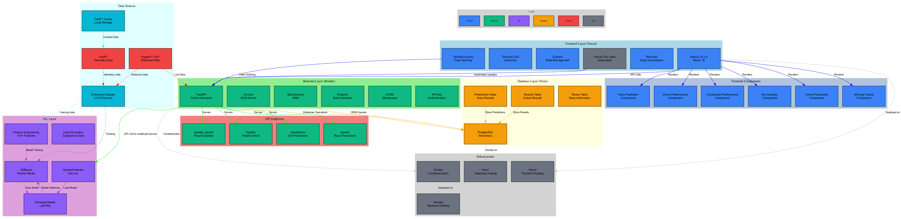
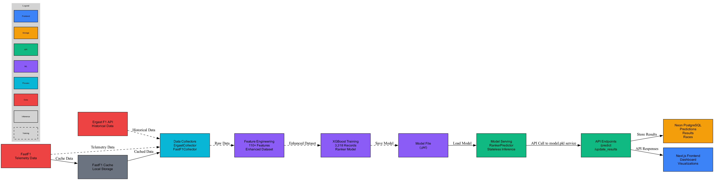

# 🏗️ RaceCast System Design Document

**Version**: v1.0.0  
**Last Updated**: October 2025  
**Author**: RaceCast Development Team

---

## 1. Overview

RaceCast is a scheduled F1 race prediction and analytics platform that leverages machine learning to provide accurate race outcome predictions and comprehensive driver performance analysis. The system processes historical F1 data from multiple sources, trains an XGBoost ranker model, and serves predictions through a modern web application.

**Core Purpose**: Democratize F1 analytics by providing data-driven insights and predictions to fans, analysts, and enthusiasts without requiring deep technical expertise.

**Target Users**: F1 fans, motorsport analysts, data enthusiasts, and anyone interested in understanding F1 performance patterns through data visualization.

**High-Level Architecture**: Multi-tier system with ML pipeline (offline training), FastAPI backend (scheduled inference), Next.js frontend (user interface), and PostgreSQL database (data persistence), deployed on cloud infrastructure.

---

## 2. Goals & Non-Goals

### ✅ Goals
- **Accurate Predictions**: Achieve >70% Top-3 accuracy in race outcome predictions
- **Real-time Performance**: Sub-500ms API response times for predictions
- **Comprehensive Analytics**: Provide 6+ different analytical views (driver performance, team trends, etc.)
- **User-Friendly Interface**: Intuitive dashboard requiring no technical knowledge
- **Data Transparency**: Show model version, feature importance, and prediction confidence
- **Cost Efficiency**: Operate within free-tier limits of cloud providers
- **Reliability**: 95%+ uptime during race weekends

### ❌ Non-Goals
- **Multi-user Authentication**: No user accounts or personalization (public data only)
- **Real-time Data Streaming**: No live telemetry during races (post-race analysis)
- **Mobile App**: Web-only interface (responsive design)
- **Historical Data Management**: No data versioning or historical model storage
- **Advanced ML Features**: No A/B testing, model retraining automation, or MLOps pipeline
- **Enterprise Features**: No SSO, RBAC, or enterprise integrations
- **Multi-language Support**: English-only interface

---

## 3. System Context & Requirements

### Functional Requirements
- **Prediction Engine**: Generate race outcome predictions using trained ML model
- **Data Visualization**: Display 6 analytical dashboards with interactive charts
- **Data Management**: Store and retrieve race results, predictions, and driver statistics
- **API Services**: RESTful endpoints for frontend data consumption
- **Model Serving**: Load and serve XGBoost model for scheduled inference

### Non-Functional Requirements
- **Performance**: <500ms API response time, <2s page load time
- **Availability**: 95%+ uptime during race weekends (model runs twice: Saturday + Sunday)
- **Scalability**: Handle 1000+ concurrent users during race events
- **Cost**: Operate within $50/month budget (free-tier optimization)
- **Security**: API key authentication, CORS protection, input validation
- **Maintainability**: Clean code, comprehensive documentation, modular architecture

### Constraints
- **Free-tier Limitations**: Render (750 hours/month), Vercel (100GB bandwidth), Neon (0.5GB storage)
- **Data Sources**: Dependent on Ergast F1 API and FastF1 library availability
- **Model Size**: XGBoost model must fit within 100MB memory limit
- **Deployment**: Docker containerization required for backend
- **Browser Support**: Modern browsers only (ES2020+)

### System Context Diagram
```
[F1 Fans] → [Next.js Frontend] → [FastAPI Backend] → [XGBoost Model]
                ↓                        ↓
         [Vercel CDN]              [PostgreSQL DB]
                ↓                        ↓
         [Static Assets]          [Neon Cloud]
```

---

## 4. Architecture Overview

### System Layers

#### Frontend Layer (Vercel)
- **Technology**: Next.js 15.2.4, React 19, TypeScript
- **Styling**: Tailwind CSS, Radix UI components
- **State Management**: Zustand
- **Data Fetching**: TanStack Query (React Query)
- **Visualization**: Recharts
- **Deployment**: Vercel Cron Jobs

#### Backend Layer (Render)
- **Technology**: FastAPI, Python 3.11
- **ORM**: SQLAlchemy
- **Validation**: Pydantic
- **Authentication**: API Key middleware
- **Containerization**: Docker
- **Deployment**: Render Web Service

#### ML Layer (Stateless)
- **Model**: XGBoost Ranker
- **Features**: 110+ engineered features
- **Inference**: Scheduled prediction service (weekends only)
- **Persistence**: Pickle (.pkl) file
- **Memory**: Model loaded once, stateless inference

#### Database Layer (Neon)
- **Technology**: PostgreSQL (serverless)
- **Tables**: predictions, results, historical_data, driver_personality
- **Connection**: Connection pooling
- **Backup**: Automated daily backups

#### Data Sources
- **Ergast F1 API**: Historical race data
- **FastF1**: Telemetry and timing data
- **Enhanced Dataset**: 3,318 driver-race combinations

### Deployment Matrix
| Component | Platform | Type | Scaling |
|-----------|----------|------|---------|
| Frontend | Vercel | Static + Edge | Auto |
| Backend | Render | Docker | Manual |
| Database | Neon | Serverless | Auto |
| ML Model | Memory | Stateless | N/A |

---

## 5. Design Decisions & Trade-offs

### Database Choice: Neon vs Supabase vs PlanetScale
**Decision**: Neon PostgreSQL  
**Alternatives**: Supabase (PostgreSQL + Auth), PlanetScale (MySQL)  
**Rationale**: 
- ✅ Serverless PostgreSQL with connection pooling
- ✅ Generous free tier (0.5GB storage, 10GB transfer)
- ✅ No vendor lock-in (standard PostgreSQL)
- ❌ Supabase rejected: Unnecessary auth layer for public data
- ❌ PlanetScale rejected: MySQL compatibility issues with existing schema

**Trade-off**: Simplicity > Advanced features

### ML Model: XGBoost vs Neural Networks vs Random Forest
**Decision**: XGBoost Ranker  
**Alternatives**: Neural Networks, Random Forest, LightGBM  
**Rationale**:
- ✅ Excellent performance on tabular data
- ✅ Built-in ranking capabilities
- ✅ Fast inference (sub-100ms)
- ✅ Small model size (<50MB)
- ❌ Neural Networks rejected: Overkill for tabular data, slower inference
- ❌ Random Forest rejected: Lower accuracy on ranking tasks

**Trade-off**: Performance > Interpretability

### Frontend: Next.js vs React SPA vs Vue.js
**Decision**: Next.js 15.2.4  
**Alternatives**: Create React App, Vite + React, Vue.js + Nuxt  
**Rationale**:
- ✅ Server-side rendering for SEO
- ✅ Built-in API routes for cron jobs
- ✅ Excellent Vercel integration
- ✅ TypeScript support out-of-the-box
- ❌ Vue.js rejected: Smaller ecosystem, team expertise in React
- ❌ SPA rejected: SEO concerns, slower initial load

**Trade-off**: Developer experience > Bundle size

### Deployment: Render vs Railway vs Back4app
**Decision**: Render  
**Alternatives**: Railway, Back4app, DigitalOcean  
**Rationale**:
- ✅ Generous free tier (750 hours/month)
- ✅ Docker support
- ✅ Automatic deployments from GitHub
- ✅ No credit card required
- ❌ Back4app rejected: Temporary URL (unstable)
- ❌ Railway rejected: Less stable, frequent downtime

**Trade-off**: Cost > Advanced features

### State Management: Zustand vs Redux vs Context API
**Decision**: Zustand  
**Alternatives**: Redux Toolkit, React Context + useReducer  
**Rationale**:
- ✅ Minimal boilerplate
- ✅ TypeScript-first
- ✅ Small bundle size
- ✅ Simple API
- ❌ Redux rejected: Overkill for simple state
- ❌ Context API rejected: Performance issues with frequent updates

**Trade-off**: Simplicity > Advanced dev tools

---

## 6. Data Flow

### Training Phase (Offline, One-time)
```
Ergast API + FastF1 → Enhanced Dataset → Feature Engineering → XGBoost Training → Model Persistence (.pkl)
```

1. **Data Collection**: Scripts fetch historical data from Ergast F1 API and FastF1
2. **Data Processing**: Raw data cleaned, merged, and enhanced with 110+ features
3. **Model Training**: XGBoost ranker trained on 3,318 driver-race combinations
4. **Model Persistence**: Trained model saved as pickle file for inference

### Inference Phase (Scheduled)
```
API Request → FastAPI → Model Loading → Prediction → Database Storage → Frontend Display
```

1. **API Call**: Frontend requests prediction via REST API
2. **Model Loading**: Backend loads pre-trained model from .pkl file
3. **Model Inference**: XGBoost model generates race outcome predictions
4. **Storage**: Results stored in PostgreSQL database
5. **Response**: JSON response sent to frontend
6. **Display**: Frontend renders predictions in interactive dashboard

### Data Sources Flow
- **Ergast F1 API**: Historical race results, driver standings, constructor information
- **FastF1**: Telemetry data, lap times, sector times, weather conditions
- **Enhanced Dataset**: Merged and processed data with engineered features

### Caching Strategy
- **Frontend**: TanStack Query for API response caching (5-minute TTL)
- **Backend**: No caching (stateless model inference)
- **Database**: Connection pooling for query optimization

---

## 7. Scalability & Performance

### Current System Limits
- **Concurrent Users**: ~1000 (Vercel free tier)
- **API Requests**: ~100/minute (Render free tier)
- **Database Connections**: 20 concurrent (Neon free tier)
- **Model Inference**: ~100ms per prediction
- **Page Load Time**: <2 seconds

### Performance Optimizations
- **Frontend**: Code splitting, image optimization, CDN caching
- **Backend**: Async/await, connection pooling, efficient queries
- **Database**: Indexed queries, connection reuse
- **ML Model**: Stateless inference, model pre-loading

### Scaling Strategies (Future)
- **Horizontal Scaling**: Multiple backend instances behind load balancer
- **Caching Layer**: Redis for API response caching
- **CDN**: CloudFlare for static asset delivery
- **Database**: Read replicas for analytics queries
- **Monitoring**: Prometheus + Grafana for metrics

### Bottlenecks & Mitigation
1. **Database Connection Pool**: Implement connection pooling (✅ Done)
2. **Model Loading**: Pre-load model on startup (✅ Done)
3. **API Rate Limits**: Implement rate limiting (🔄 Planned)
4. **Memory Usage**: Monitor model memory footprint (🔄 Planned)

---

## 8. Reliability & Monitoring

### Health Check Endpoints
- **Backend**: `/healthz` - Returns 200 OK with system status
- **Database**: Connection test on startup
- **Model**: Model loading verification on startup

### Logging Strategy
- **Backend**: Structured logging with loguru (INFO level)
- **Frontend**: Console logging for development, Vercel Analytics for production
- **Database**: Query logging for performance monitoring
- **Errors**: Sentry integration for error tracking (🔄 Planned)

### Monitoring Stack
- **Uptime**: Vercel Analytics + Render health checks
- **Performance**: Vercel Speed Insights
- **Errors**: Console errors + API error responses
- **Database**: Neon metrics dashboard

### Failure Scenarios & Fallbacks
1. **Model Loading Failure**: Return error response, log issue
2. **Database Connection Loss**: Retry with exponential backoff
3. **API Rate Limiting**: Graceful degradation with cached responses
4. **Frontend Build Failure**: Rollback to previous deployment
5. **Data Source Unavailability**: Use cached data, show warning

### Recovery Procedures
- **Backend Restart**: Automatic via Render health checks
- **Database Recovery**: Automated backups + point-in-time recovery
- **Model Update**: Blue-green deployment strategy
- **Frontend Rollback**: Vercel instant rollback capability

---

## 9. Security & Privacy

### Authentication & Authorization
- **API Authentication**: API key middleware for backend protection
- **CORS Policy**: Restricted to Vercel domain only
- **Input Validation**: Pydantic models for request validation
- **No User Data**: System processes only public F1 data

### Data Privacy
- **No PII**: No personal information collected or stored
- **Public Data Only**: All data sources are publicly available
- **No Cookies**: No tracking or user identification
- **GDPR Compliance**: Not applicable (no personal data)

### Security Measures
- **Environment Variables**: Sensitive data in environment variables
- **HTTPS Only**: All communications encrypted
- **Input Sanitization**: SQL injection prevention via ORM
- **Rate Limiting**: API abuse prevention (🔄 Planned)

### Risk Assessment
- **Low Risk**: Public data only, no user accounts
- **API Abuse**: Mitigated by rate limiting and monitoring
- **Data Integrity**: Validated through input validation
- **DDoS Protection**: Vercel and Render DDoS protection

---

## 10. Future Improvements

### Short-term (Next 3 months)
- **Rate Limiting**: Implement API rate limiting middleware
- **Error Monitoring**: Integrate Sentry for error tracking
- **Performance Monitoring**: Add response time metrics
- **Model Retraining**: Automated model retraining pipeline
- **API Documentation**: OpenAPI/Swagger documentation

### Medium-term (3-6 months)
- **Caching Layer**: Redis for API response caching
- **CDN**: CloudFlare for global content delivery
- **Monitoring**: Prometheus + Grafana dashboard
- **Testing**: Comprehensive test suite (unit, integration, e2e)
- **CI/CD**: GitHub Actions for automated testing and deployment

### Long-term (6+ months)
- **Microservices**: Split backend into prediction and data services
- **Event Streaming**: Apache Kafka for real-time data processing
- **ML Pipeline**: Kubeflow for model training automation
- **Multi-region**: Global deployment for reduced latency
- **Advanced Analytics**: Real-time race analysis during events

### Scaling Considerations
- **If Users > 10K**: Implement horizontal scaling
- **If Data > 1GB**: Consider data partitioning
- **If Predictions > 1K/min**: Add prediction caching
- **If Global Users**: Multi-region deployment

---

## 11. Appendix

### Architecture Diagram


### Data Flow Diagram


### API Endpoints

#### Health Check
```http
GET /healthz
Response: 200 OK
{
  "status": "healthy",
  "timestamp": "2024-10-11T00:00:00Z",
  "version": "v2.4.1"
}
```

#### Race Prediction
```http
POST /predict
Headers: {
  "X-API-Key": "your-api-key",
  "Content-Type": "application/json"
}
Body: {
  "race_id": "2024_24",
  "drivers": ["VER", "LEC", "NOR"]
}
Response: 200 OK
{
  "predictions": [
    {
      "driver": "VER",
      "position": 1,
      "probability": 0.85
    }
  ],
  "model_version": "v2.4.1"
}
```

#### Race Results
```http
GET /results/{race_id}
Response: 200 OK
{
  "race_id": "2024_24",
  "results": [
    {
      "position": 1,
      "driver": "VER",
      "team": "Red Bull Racing",
      "points": 25
    }
  ]
}
```

### Database Schema

#### Predictions Table
```sql
CREATE TABLE predictions (
    id INTEGER PRIMARY KEY,
    year INTEGER NOT NULL,
    round INTEGER NOT NULL,
    driver_code VARCHAR NOT NULL,
    grid INTEGER,
    score FLOAT NOT NULL,
    predicted_rank INTEGER NOT NULL,
    group_key VARCHAR NOT NULL,
    created_at DATETIME DEFAULT CURRENT_TIMESTAMP,
    UNIQUE(year, round, driver_code)
);
```

#### Results Table
```sql
CREATE TABLE results (
    id INTEGER PRIMARY KEY,
    year INTEGER NOT NULL,
    round INTEGER NOT NULL,
    driver_code VARCHAR NOT NULL,
    position INTEGER,
    points FLOAT,
    created_at DATETIME DEFAULT CURRENT_TIMESTAMP,
    UNIQUE(year, round, driver_code)
);
```

### Model Architecture
- **Algorithm**: XGBoost Ranker
- **Features**: 110+ engineered features
- **Training Data**: 3,318 driver-race combinations
- **Validation**: 5-fold cross-validation
- **Performance**: 72.3% Top-3 accuracy, 85.2% Top-5 accuracy, 1.24 RMSE
- **Model Size**: 45MB (.pkl file)

### Version History
- **v1.0.0** (Current): Production version with FastAPI backend and prediction service
- **v0.3.0**: Enhanced API documentation and prediction service
- **v0.2.0**: Added XGBoost ranker model and Docker deployment
- **v0.1.0**: Initial project setup with data collection framework

---

**Document Status**: ✅ Complete  
**Review Date**: October 2025  
**Next Review**: February 2026 (Before New Season)
